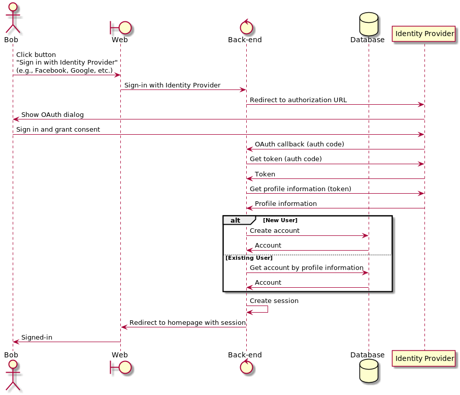

# Example Single Sign-On (SSO)


## demo


## Getting Started

### Usage

Run the dockerized application by executing the following command:
```
docker-compose up
```

And visit https://localhost with your favourite web browser.

### Prerequisites

- [Docker Compose](https://docs.docker.com/compose/install/).

### Single Sign-On Providers

You will need to configure at least 1 single sign-on provider. The more the better.

#### Facebook

1. Go to [Facebook for Developers](https://developers.facebook.com/).
1. Go to `My Apps` and create a new app by clicking on `Create App` (select "Build Connected Experiences").
1. Scroll down and under `Add Products to Your App`, click `Set Up` in the `Facebook Login` card. In the left side navigation panel, go to `Facebook Login` > `Settings`, under `Valid OAuth Redirect URIs` enter `https://localhost/api/v1/single-sign-on/facebook/callback`.
1. Go to `Settings` > `Basic` and copy `App ID` and `App Secret`.
1. In `docker-compose.yml`, replace the values of `FACEBOOK_CLIENT_ID` and `FACEBOOK_CLIENT_SECRET` with the values of `App ID` and `App Secret` respectively.

#### GitHub
1. On github.com, go to `Settings` > `Developer Settings` > `OAuth Apps` (or click [here](https://github.com/settings/developers)).
1. Click on `New OAuth App`.
1. Fill in `https://localhost` for `Homepage URL` and `https://localhost/api/v1/single-sign-on/github/callback` for `Authorization callback URL`, and click on `Register Application`.
1. From `General`, copy `Client ID` and generate a new `Client Secret`.
1. In `docker-compose.yml`, replace the values of `GITHUB_CLIENT_ID` and `GITHUB_CLIENT_SECRET` with the values of `Client ID` and `Client Secret` respectively.

#### Google
1. Go to [Google Console Developer APIs & Services](https://console.developers.google.com/apis)
1. From the projects list, create a new project.
1. Go to `OAuth consent screen` in the left side navigation panel.
1. Configure the `OAuth consent screen`.
Fill in all required fields and click `save and continue`.
1. Go to `Credentials` in the left side navigation panel.
1. Click `create credentials` in the top navigation panel and select `OAuth Client ID`. For `Application Type` select `Web application`. Under `Authorized redirect URIs` add the callback uri `https://localhost/api/v1/single-sign-on/google/callback`. Finally, click `create`.
1. Copy `Client ID` and `Client Secret`.
1. In `docker-compose.yml`, replace the values of `GOOGLE_CLIENT_ID` and `GOOGLE_CLIENT_SECRET` with the values of `Client ID` and `Client Secret` respectively.

If you're experiencing difficulties setting up the OAuth Client, see https://support.google.com/cloud/answer/6158849.

## Single Sign-On Flow


